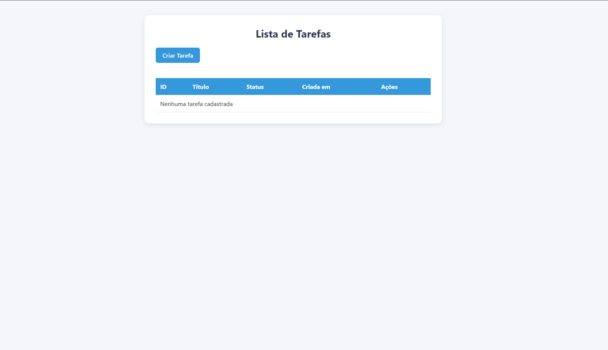
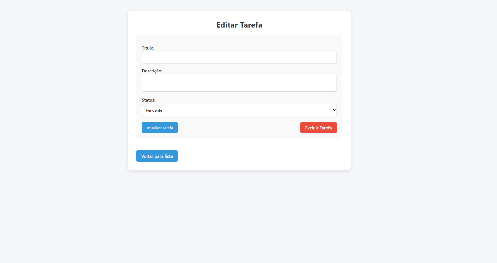

# 🚀 STARTELY - PHP Back-End Challenge

    

## 📋 Índice
- [🎯 Objetivo](#-objetivo)
- [🧠 Requisitos de Conhecimento](#-requisitos-de-conhecimento)
- [📝 Descrição do Desafio](#-descrição-do-desafio)
- [⚙️ Funcionalidades Obrigatórias](#️-funcionalidades-obrigatórias)
- [🗄 Banco de Dados](#-banco-de-dados)
- [📂 Estrutura do Projeto](#-estrutura-do-projeto)
- [🚀 Como Executar o Projeto](#-como-executar-o-projeto)
- [🖼️ Screenshots do Projeto](#️-screenshots-do-projeto)
- [📝 Regras do Git](#-regras-do-git)
- [🔍 Critérios de Avaliação](#-critérios-de-avaliação)
- [⏰ Tempo Estimado](#-tempo-estimado)
- [💻 Tecnologias Utilizadas](#-tecnologias-utilizadas)

## 🎯 Objetivo
Desenvolver uma aplicação back-end em **PHP puro** com conexão a **MySQL**, realizando operações básicas de **CRUD** (Create, Read, Update, Delete) para um sistema de gerenciamento de tarefas, com código limpo, organizado e versionado corretamente no **Git**.

## 🧠 Requisitos de Conhecimento
Este desafio testa conhecimentos básicos em:

- 🐘 **PHP** (estrutura, sintaxe, lógica)  
- 🛢️ **MySQL** (banco de dados relacional)  
- 🗂️ **Modelagem de dados simples**  
- 📁 Organização de arquivos e pastas  
- 🌱 Uso de **Git** (branch, commit, versionamento)  
- ✅ Boas práticas (modularização, DRY, código limpo)

## 📝 Descrição do Desafio
Você deve criar uma aplicação que permita **cadastrar, listar, editar e excluir tarefas**.  
Cada tarefa deve conter:

- 🔹 **ID** (gerado automaticamente)  
- 🔹 **Título da tarefa**  
- 🔹 **Descrição** (opcional)  
- 🔹 **Status** (pendente, em andamento, concluída)  
- 🔹 **Data de criação** (automática)

## ⚙️ Funcionalidades Obrigatórias

### 1. Criar Tarefa
- Rota que recebe os dados (**POST**) e insere no banco.

### 2. Listar Tarefas
- Rota que exibe todas as tarefas cadastradas.

### 3. Editar Tarefa
- Rota que recebe um **ID** e permite atualizar os dados da tarefa.

### 4. Excluir Tarefa
- Rota que recebe um **ID** e exclui a tarefa correspondente.

## 🗄 Banco de Dados
Crie uma tabela chamada `tarefas` com os seguintes campos:

| Campo       | Tipo          | Observação                   |
|------------|--------------|------------------------------|
| id         | INT          | AUTO_INCREMENT, PK           |
| title      | VARCHAR(255) | Título da tarefa             |
| description| TEXT         | Opcional                     |
| status     | ENUM         | 'pendente','em andamento','concluída' |
| created_at | DATETIME     | Automático                   |

## 📂 Estrutura do Projeto

```
php-todolist/
│
├── index.php                 # Página principal
├── config/
│   └── database.php          # Configuração do banco de dados
├── src/
│   ├── models/
│   │   └── Task.php          # Modelo de Tarefa
│   ├── controllers/
│   │   └── TaskController.php # Controlador de Tarefas
│   └── views/
│       ├── header.php        # Cabeçalho das páginas
│       ├── footer.php        # Rodapé das páginas
│       ├── list.php          # Lista de tarefas
│       ├── create.php        # Formulário de criação
│       └── edit.php          # Formulário de edição
├── public/
│   └── css/
│       └── style.css         # Estilos CSS
├── .gitignore               # Arquivos ignorados pelo Git
└── README.md                # Documentação do projeto
```

## 🚀 Como Executar o Projeto

1. **Pré-requisitos**:
   - PHP 7.4 ou superior
   - MySQL 5.7 ou superior
   - Servidor web (Apache recomendado)

2. **Clone o repositório**:
   ```bash
   git clone https://github.com/startely/desafio-backend-estagio.git
   cd php-todolist
   ```

3. **Configurar o banco de dados**:
   - Crie um banco de dados MySQL chamado `todolist`
   - Execute o seguinte SQL para criar a tabela:
   ```sql
   CREATE TABLE tarefas (
     id INT AUTO_INCREMENT PRIMARY KEY,
     title VARCHAR(255) NOT NULL,
     description TEXT,
     status ENUM('pendente', 'em andamento', 'concluída') DEFAULT 'pendente',
     created_at DATETIME DEFAULT CURRENT_TIMESTAMP
   );
   ```

4. **Configurar conexão com o banco**:
   - Edite o arquivo `config/database.php` com suas credenciais:
   ```php
   define('DB_HOST', 'localhost');
   define('DB_NAME', 'todolist');
   define('DB_USER', 'seu_usuario');
   define('DB_PASS', 'sua_senha');
   ```

5. **Executar o projeto**:
   ```bash
   # Usando o servidor embutido do PHP
   php -S localhost:8000
   ```
   
6. **Acessar a aplicação**:
   - Abra seu navegador e vá para `http://localhost:8000`

## 🖼️ Screenshots do Projeto

### Página Principal - Lista de Tarefas


### Formulário de Criação de Tarefa


### Formulário de Edição de Tarefa



## 📝 Regras do Git

- Crie um repositório Git com o nome `php-todolist`.  
- Crie uma branch: `feature/task-crud`.  
- Todos os commits devem ser em **inglês**, ex:  
  `add task model`, `create task form`, `fix task update query`.
- Faça commits pequenos e atômicos, com mensagens descritivas.
- Use conventional commits (feat, fix, docs, style, refactor, test, chore).

## 🔍 Critérios de Avaliação

- ✅ Funcionamento básico do CRUD  
- ✅ Uso correto de **PHP** e **MySQL**  
- ✅ Uso de **PDO** (diferencial)  
- ✅ Estrutura organizada do código  
- ✅ Commits claros e bem nomeados  
- ✅ README explicativo  
- ✅ Separação entre lógica, dados e visual (MVC simplificado)
- ✅ Tratamento de erros e validações
- ✅ Interface amigável e responsiva

## ⏰ Tempo Estimado
Você terá **14 dias úteis** (Total de duas semanas) para finalizar o desafio.

## 💻 Tecnologias Utilizadas

- 🐘 PHP  
- 🛢️ MySQL (com PDO)
- 🌐 HTML5/CSS3
- 🌱 Git
- 🎨 JavaScript (para melhorias de UX opcionais)